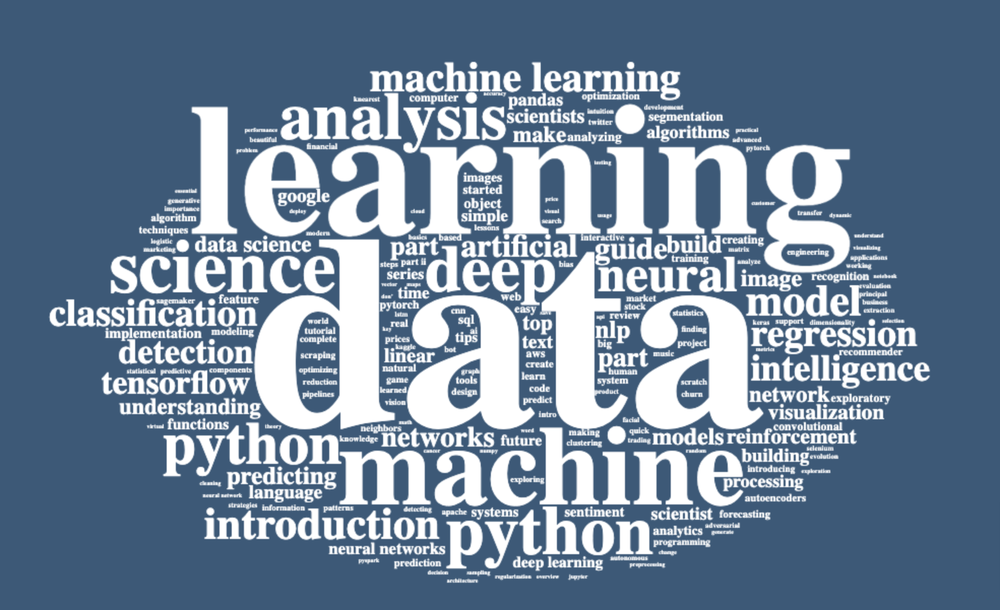
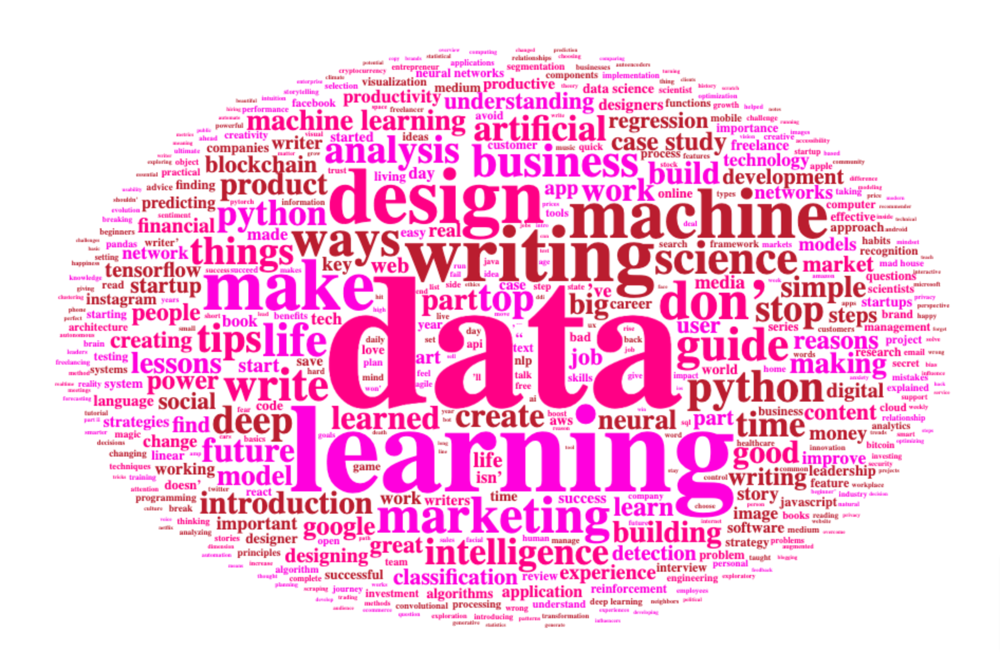

## Medium articles word cloud :cloud:
Understand the keywords that headline use to and topic choose, for the articles. The data can be found here,  source link, - [Medium_data](https://www.kaggle.com/datasets/dorianlazar/medium-articles-dataset?select=medium_data.csv). Two main publication on which word cloud is created from medium articles are,
+ Towards Data Science
+ Better Marketing

#### Towards Data Science

#### Better Marketing

